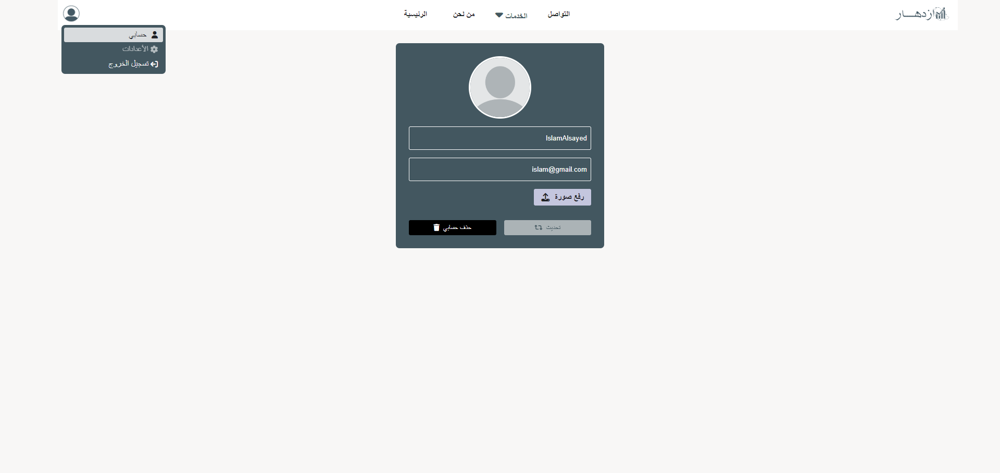

# Izdihar - Retirement and Debt Management System

## Source code is private

Izdihar is a system designed to help users plan for retirement and manage their debts effectively. Users can input their retirement goals and current debts, and the system will calculate the monthly savings needed to achieve the retirement goal. Additionally, the system provides visualization of monthly expenses and targeted savings through charts.

## Features

- User login and session management
- Track and manage debts
- Plan for retirement goals
- Visualize monthly expenses and targeted savings with charts

## Usage

1. Register a new user or log in with an existing account.
2. Navigate to the budget planning section.
3. Enter retirement goals and current debts.
4. View the calculated monthly savings needed to achieve retirement goals.
5. Visualize monthly expenses and targeted savings through the provided charts.

## Dependencies

- Html
- Css
- JavaScript
- Ajax
- PHP 8.4.2
- Sql
- MySQL

# Overview

## home

home page of the project.

## signin

signin page of the project.

## register

register page of the project.

## about-us

about-us page of the project.

## contact-us

contact-us page of the project.

## services

services page of the project.

## retirement-plan

retirement-plan page of the project.

## retirement-plan-chart

retirement-plan-chart page of the project.

## budget

budget page of the project.

## budget-chart

budget-chart page of the project.

## debts

debts page of the project.

## debts-details

debts-details page of the project.

## education

education page of the project.

## profile

profile page of the project.

## Contributing

Contributions are welcome! Please open an issue or submit a pull request.

## Credits

This project was developed by IslamAlsayed and OlaHamdy.

## Contact me

### If you have any questions or need further assistance, you can reach out to me:

### Email: eslamalsayed8133@gmail.com

### LinkedIn: [IslamAlsayed](https://www.linkedin.com/in/islam-alsayed7)
